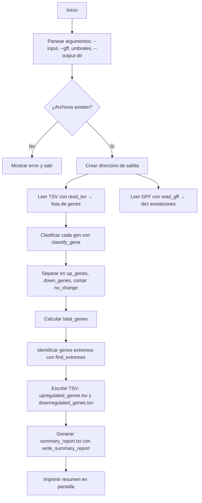

# Diagrama del flujo del proyecto

# ── Uso de IA ───────────────────────────────────────────────
# Herramienta : Deepseek
# Prompt usado: "crea un diagrama de flujo tipo Mermaid con el pipeline del proyecto"
# Qué generó  : generó el diagrama de flujo del proyecto
# Qué modifiqué: reducí y reestructuré flujo
# ────────────────────────────────────────────────────────────
